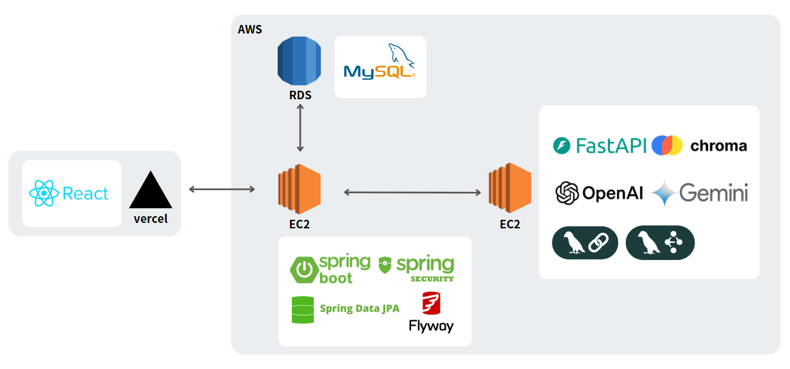
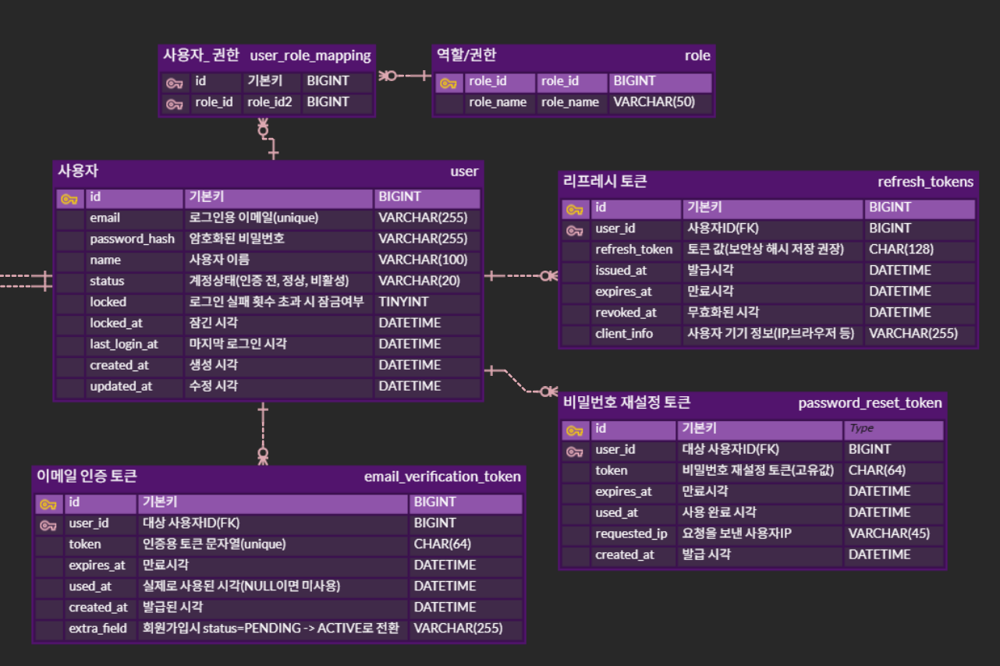
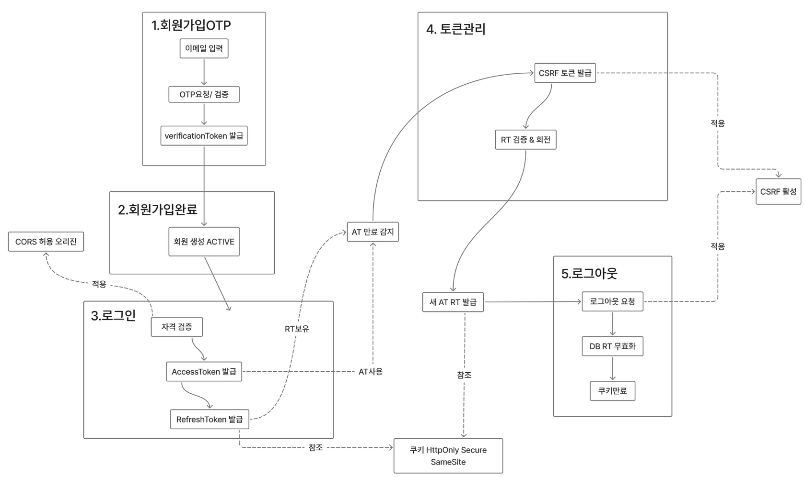
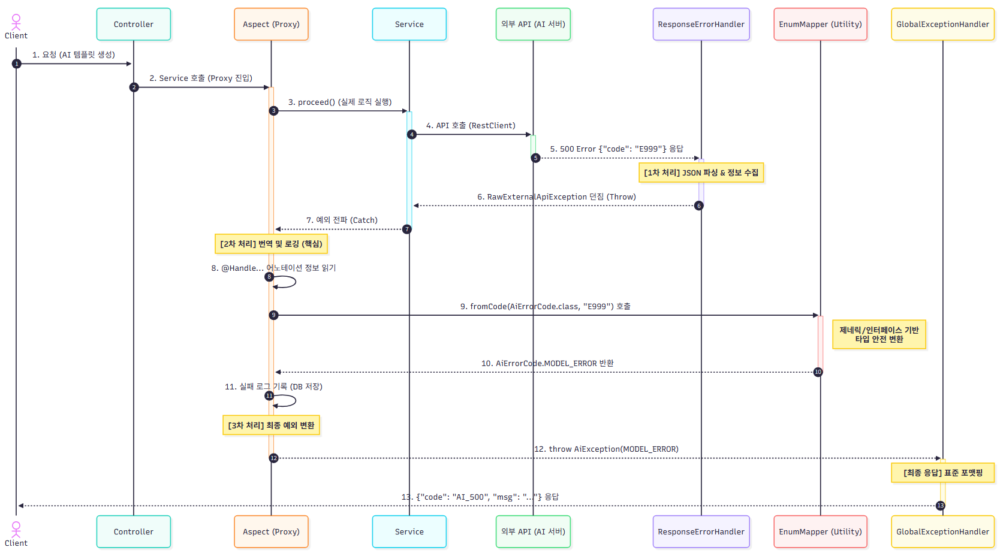

# 📄 Jober Backend

> **AI 기반 템플릿 생성 및 사용자 관리 플랫폼 Jober의 백엔드 리포지토리입니다.**
> 자세한 프로젝트 소개는 [Main Repository](https://github.com/jober3)에서 확인할 수 있습니다.

---

## 👥 팀
백엔드 팀은 2명으로 구성되어 있으며, 도메인 단위로 책임을 분리하여 개발을 진행했습니다.

| 이름 (GitHub) | 담당 도메인 | 주요 역할 |
|:------------| :--- | :--- |
| **손장호**     | **User Domain** | 사용자 인증/인가, 회원 정보 관리, 유저 흐름 설계 |
| **강민서**     | **Template Domain** | AI 템플릿 생성 로직, 외부 API 연동, AOP 기반 에러 핸들링 구축 |


## 📦 개발 환경
| Category | Technologies                               |
| :--- |:-------------------------------------------|
| **Language & Framework** | Java 21, Spring Boot 3                     |
| **Database** | MySQL, Spring Data JPA (Hibernate), Flyway |
| **Build Tool** | Maven                                      |
| **Infra & Deployment** | AWS EC2, AWS RDS                           |
| **Testing** | JUnit 5, Mockito, WireMock, H2             |

## 💻 시스템 아키텍처 & 플로우
클라이언트, 웹 서버, DB, 그리고 외부 AI 서비스 간의 전체적인 구조입니다

### ERD
#### User


#### Template


### Flow
#### User
> 사용자 회원가입 및 로그인, 토큰 관리 프로세스



#### Template
> 템플릿 생성 시 사용하는 외부 AI API와의 통신
> 


---

## ⚙️ 실행 방법

### 1. 레포지토리 클론
```bash
git clone https://github.com/Kernel180-BE12/Final3team-jober_to_java.git
cd Final3team-jober_to_java

2. Docker로 MySQL 실행
docker compose up -d


기본 설정:

DB 이름: appdb

유저: root

비밀번호: rootpw

포트: 3307 (호스트) → 3306 (컨테이너)

3. Spring Boot 실행

IntelliJ에서 FinalProjectsApplication 실행 또는 터미널에서:

./mvnw spring-boot:run

4. 정상 동작 확인

DB Health 체크:
http://localhost:8080/health/db

👉 결과: {"ok":true}

CRUD 예제 (Person):

POST http://localhost:8080/people

{
  "name": "홍길동"
}


GET http://localhost:8080/people

[
  {
    "id": 1,
    "name": "홍길동"
  }
]

🗂️ 프로젝트 구조
src/main/java/com/example/final_projects
 ├── FinalProjectsApplication.java   # 메인 클래스
 ├── controller/                     # REST 컨트롤러
 ├── entity/                         # JPA 엔티티
 ├── repository/                     # JPA 레포지토리
 └── service/                        # 서비스 계층 (추가 예정)
src/main/resources
 ├── application.yml                 # DB/환경 설정
 └── ...

🐳 Docker 컨테이너 관리

상태 확인:

docker ps


로그 확인:

docker logs -f demo-mysql


컨테이너 중지:

docker compose down

🤝 Git 브랜치 전략

main: 배포/안정 버전

feature/*: 기능 개발용 브랜치

fix/*: 버그 수정 브랜치

예시:

git checkout -b feature/user-api
git push origin feature/user-api

👨‍👩‍👧 팀원 세팅 체크리스트

 JDK 21+ 설치 (23도 가능, 타깃은 21)

 IntelliJ 설치 및 프로젝트 Import

 Docker Desktop 설치 + 실행

 docker compose up -d 로 MySQL 실행

 application.yml 에 DB 포트(3307) 확인

 ./mvnw spring-boot:run 실행해서 /health/db 확인
